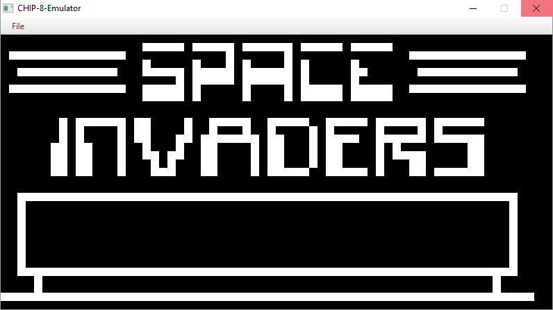

# CHIP-8-Emulator
CHIP-8 is an interpreted programming language used for the COSMAC VIP and Telmac 1800 8-bit microcomputers in the mid-1970s. 
CHIP-8 is a great starting project if you want to look into creating emulators and that is the reason for me making this project.
I decided to use a programming language I feel comfortable in so I've implemetned this CHIP-8 emulator / interpreter in Java.

## Lessons learned
While developing this application I learned once again more about bitwise operations and how to use them in real applications, the most 
interesting part was to learn about how to emulate or interpret in this case another program written by someone else in another language. Wikipedia
was to great help and a great resource for the operations connected to each opcode. I learned more about JavaFX and it's canvas and AnimationTimer which 
was very refreshing compared to building applications mostly relying on control objects. 

## References
Here are some useful resources used while building this application.

* [http://en.wikipedia.org/wiki/CHIP-8](http://en.wikipedia.org/wiki/CHIP-8)
* [http://www.multigesture.net/articles/how-to-write-an-emulator-chip-8-interpreter/](http://www.multigesture.net/articles/how-to-write-an-emulator-chip-8-interpreter/)
* [http://devernay.free.fr/hacks/chip8/C8TECH10.HTM](http://devernay.free.fr/hacks/chip8/C8TECH10.HTM)
